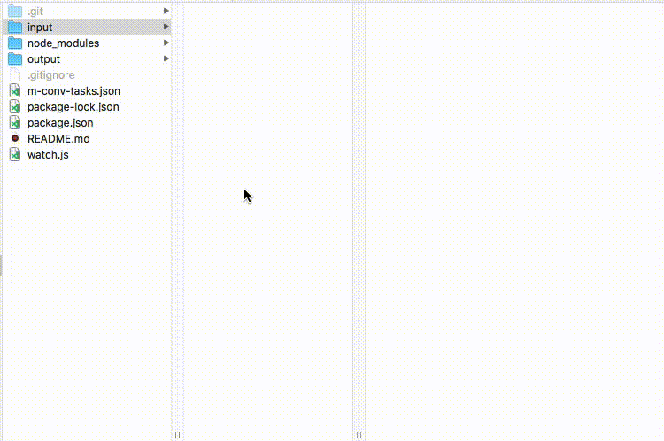

# m-conv

m-conv watches a directory and converts media files according to rules defined in a `m-conv-tasks.json` file. It's supposed to be used on a server where the users can copy their media files onto a network share and then receive their converted files in the output folder.

## Demo



## Example Task

The example tasks converts videos to 720p using `ffmpeg`.

```
{
  "tasks": [
    {
      "group": "videos",
      "command": "ffmpeg -i \"{{input}}\" {{flags}} \"{{output}}\"",
      "matched_ext": [
        "mp4",
        "mpg",
        "mpeg",
        "wmv",
        "flv",
        "avi",
        "mov"
      ],
      "jobs": [
        {
          "name": "720p_H264_medium",
          "flags": "-vf scale=1280:-2 -c:v libx264 -crf 20",
          "out_ext": "mp4"
        },
        {
          "name": "720p_H264_high",
          "flags": "-vf scale=1280:-2 -c:v libx264 -crf 15",
          "out_ext": "mp4"
        }
      ]
    }
  ]
}
```

### Keys

#### `group`

Name of the group, must be unique among tasks.

#### `command`

Template string for the command that will be executed. You can use the following variables:

* `{{input}}`: Absolute path to the input file, e.g. `/var/media/file 1.jpg`
* `{{output}}`: Absolute path to the output file, e.g. `/var/media/out/file 1.jpg`
* `{{flags}}`: Flags that are defined in each job

**Careful:** Make sure to always escape input and output variables with quotation marks as demonstrated in the example task.

#### `matched_ext`

Array of file extensions that you want to execute this task on. Do not include a dot before the extension.

#### `jobs`

Array of jobs you want to execute for each file. The `name` of a job is going to be the name of the output directory. `out_ext` is the extension that will be added to the final output path in the template variable `{{output}}`.

